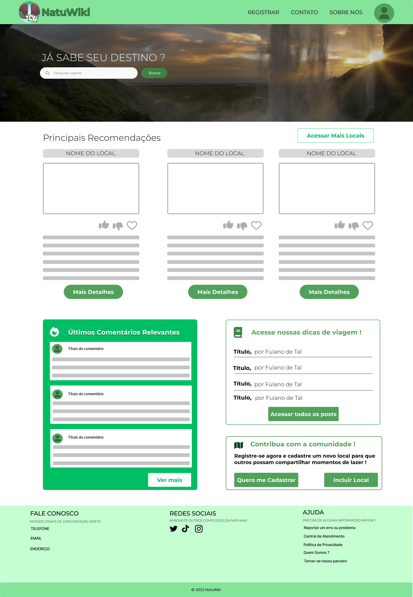

# Informações do Projeto

NATUWiki

Sistemas de informação

## Participantes

Danielle Santos Torres |
Davi Martins Freitas de Oliveira Fonseca |
Gabriel Hubner Bastos Athaide |
Gabriel Santos da Silva |
Hayanne Santos da Silva |
Pedro Ribeiro Canuto

# Estrutura do Documento

- [Informações do Projeto](#informações-do-projeto)
  - [Participantes](#participantes)
- [Estrutura do Documento](#estrutura-do-documento)
- [Introdução](#introdução)
  - [Problema](#problema)
  - [Objetivos](#objetivos)
  - [Público-Alvo](#público-alvo)
- [Especificações do Projeto](#especificações-do-projeto)
  - [Personas](#personas)
  - [Histórias de Usuários](#histórias-de-usuários)
  - [Requisitos](#requisitos)
- [Projeto da Solução](#projeto-da-solução)
  - [Wireframes](#wireframes)
  - [Mapa de navegação](#mapa-de-navegação)
- [Conclusões](#avaliação-da-aplicação)
  
# Introdução

## Problema

  O ato de realizar o planejamento de viagens e passeios envolvendo o ecoturismo pode desencadear alguns problemas na vida de certas pessoas.
A falta de experiência e conhecimento sobre ambientes voltados para a natureza disponíveis para visitação além da falta de acesso a informações
detalhadas e organizadas sobre a infraestrutura e trajeto até tais locais são exemplos desses problemas e a natuwiki surge para auxiliar essas pessoas
que quando pensam em realizar um ecoturismo, esbarram nesses problemas.

## Objetivos

  A NATUWIKI está sendo desenvolvida para ser um software utilizado como suporte para planejamentos de passeios ecoturísticos em Belo Horizonte e região Metropolitana.
Tendo em mente os problemas citados no último tópico, o site busca entregar aos usuários todo as informações necessárias para um bom planejamento das suas viagens com,
dicas de locais para visitação, avaliação dos locais publicados nos sites, descrição sobre tais locais com imagens reais, informações sobre a infraestrutura do local,
preços e informações sobre possíveis aventuras que possam ser disponibilizadas nos locais, ou seja, tentando abranger todos os problemas encontrados na hora de planejar um passeio desse nível.

  O problema da informação sobre infraestrutura do local é um dos objetivo alvo desse trabalho. Para isso, todos os locais disponibilizados no site terão uma descrição detalhada sobre tudo que é oferecido naquele local. Pensando em uma área de camping, o site informará se nesse ambiente possuem chalés para acomodação ou se são somente espaços para barracas, se esses espaços são cobertos ou não, se há fornecimento de água tratada e pontos de energia, por outro lado se o local disponibilizar alguma acomodação será necessária informações sobre como são as acomodações, preços, como é a distribuição de banheiros, água tratada e alimentação, se há internet disponível no local, com isso a natuwiki tem como objetivo dar ao usuário toda a informação que ele possa precisar sobre a infraestrutura do local que ele deseja visitar.
  
  Outro objetivo alvo da NATUWIKI é em relação a participação do usuário na construção e manutenção do site. A natuwiki irá ter um foco nas avalições dos usuários sobre locais que esses já visitaram, dando a oportunidade que eles compartilhem informações sobre as reais condições dos locais, as opções de lazer nos locais, como chegaram e valor que realmente pagaram, dando a oportunidade de outros usuários sentirem uma experiência real sobre tais locais a partir dessas informações relatadas e de avaliações que serão disponibilizadas no site.
> 
>
> 

## Público-Alvo

A NatuWiki possui como público-alvo amantes da natureza, 
pessoas que eu seu interior sentem prazer e alegria em estar em contato com a natureza,
independente se é em momentos de lazer, descanso ou aventura, mas encontram dificuldades no acesso à informações relevantes sobre os locais que desejam visitar ao planejar uma viagem, por exemplo.
Tais pessoas, na maioria das vezes, já possuíram contato com a natureza e por isso
desenvolveram interesse em compartilhar momentos nesses ambientes, e portanto, a descoberta de informações relevantes dos ambientes, locais e acomodações são necessárias para alcançar o desejo de desfrutar um tempo na natureza.

# Especificações do Projeto

> Apresente uma visão geral do que será abordado nesta parte do
> documento, enumerando as técnicas e/ou ferramentas utilizadas para
> realizar a especificações do projeto

## Personas

Para a elaboração da natuwiki foram pensadas duas personas:

Persona 1
Nome: Anna Beatriz
Idade: 27 anos
Ocupação: Advogada, há 2 exercendo a profissão

O que a motiva ?
Estudos, quer se tornar juíza; se dedica no ambiente de trabalho e nos estudos necessários
pra isso, mas não abre mão de seus momentos de lazer e relaxamento, por isso também
gosta de ambientes calmos, tranquilos e refrescantes para passar um fim de semana ou um
período e revigorar sua disposição, tanto física quanto mental.

O que a frustra ?
Desorganização, Anna é uma pessoa calma, mas organizada. Gosta de organizar
informações sobre os lugares que viaja e frequenta, por exemplo, tirar e salvar várias
fotografias, além de compartilhar suas experiências nesses locais. Por isso se sente um
pouco frustrada quando a rotina pesada a sobrecarrega e não permite que ela faça isso ou
quando demora muito para realizar essa organização.

História, hobbies e outros detalhes:
Anna é estudiosa e responsável. Terminou o curso de direito aos 25 anos e se mudou do
interior para Belo Horizonte há pouco tempo. Para não ficar o tempo todo presa às
pressões do ambiente corporativo, gosta desse contato com a natureza, em lugares mais
tranquilos. Quando encontra, sempre salva posts de dicas de locais ao redor de Belo
Horizonte em redes sociais e guarda na galeria fotos dos lugares que visita, mas ainda
gostaria de se organizar melhor com relação a isso. Como hobby, gosta de tirar fotos e
compartilhá-las e mais recentemente, está se aventurando em fazer trilhas e caminhadas,
embora não encontre muitos locais para fazer isso com facilidade.

Persona 2
Nome: Nivaldo Lima
Idade: 30 anos
Ocupação: Desenvolvedor Front-End

O que o motiva ?
Nivaldo possui sua formação e carreira já bem estruturadas. Formado e em atuação no
mercado de trabalho, Nivaldo agora busca estar sempre conhecendo novos locais e
paisagens alimentando seu maior prazer que é estar em contato com a natureza. Utiliza
parte de seu tempo e salário para planejar viagens que o permita realizar suas trilhas,
conhecer cachoeiras e parques ao mesmo tempo que o permita trabalhar sem problemas.

O que o frustra ?
Devido a sua ocupação profissional, Nivaldo necessita sempre de conexões com a internet
e por isso sempre planeja bem suas viagens para que não tenha problemas de ir a algum
local sem conexão nenhuma de rede. Sua maior frustração vem de momentos em que
durante o planejamento ele não consegue informações suficientes sobre os hotéis, chalés e
cabanas que o permitam ter segurança sobre ter ou não conexão com internet e com isso
não conseguir ter certeza sobre seu destino, o que o impede de fazer a viagem.

História, hobbies e outros detalhes:
Nivaldo sempre procura passeios e aventuras que possam ser feitos com motos ou carros,
seja uma trilha de quadriciclo ou moto ou somente a possibilidade de ir para um camping
dirigindo já o alegra, o que torna seus planejamentos mais exigentes pois precisa além de
conhecimento sobre a disponibilidade de rede no local, também necessita de informações
sobre o acesso ao local e opções de lazer nas proximidades. Devido ao modo de trabalho e
histórico familiar de Nivaldo, seu conhecimento sobre locais de lazer já é bem vasto o que
permite que ele possa passar bastante informações e dicas de viagens para seus amigos e
conhecidos.

## Histórias de Usuários

Com base na análise das personas forma identificadas as seguintes histórias de usuários:

|EU COMO ANNA BEATRIZ | QUERO/PRECISO                           |PARA                                    |
|---------------------|-----------------------------------------|----------------------------------------|
|   Usuária do site   | Quero encontrar locais na natureza      |  Poder realizar um passeio tranquilo,  |
| Natuwiki            | para relaxar e desansar a mente e       | seguro e relaxante mesmo tendo pouca   |
|                     | preciso de um site que me dê informações| experiência no ramo                    |
|                     | precisas e simplificadas pois não tenho |                                        |
|                     | tempo e experiência para fazer grandes  |                                        |
|                     | estudos para a viagem.                  |                                        | 

|EU COMO NIVALDO LIMA    | QUERO/PRECISO                               |PARA                                    |
|------------------------|---------------------------------------------|----------------------------------------|
|   Usuário do site      | Quero encontrar acomodações que me permitam |  Poder conciliar minha paixão com a    |
| Natuwiki e trabalhador | aproveitar o contato com a natureza e ao    | natureza e a minha rotina de trabalho  |
| da área de TI          | mesmo tempo me permitam estar disponível    | home office sem preocupações           |
|                        | para meu trabalho. Para isso, preciso de    |                                        |
|                        | informações bem detalhadas sobre a infra-   |                                        |
|                        | estrutura do local para saber se terei      |                                        | 
|                        | conexão com a internet e locais privados    |                                        |
|                        | para possíveis reuniões.                    |                                        |
                           
                           
## Requisitos

A tabela que segue apresenta os requisitos funcionais do projeto. 

### Requisitos Funcionais

|ID    | Descrição do Requisito  | Prioridade |
|------|-----------------------------------------|----|
|RF-001| Permitir que o usuário busque locais pelo nome | ALTA | 
|RF-002| Permitir que o usuário acesse informações detalhadas sobre os locais ao encontrar um de seu interesse | ALTA | 
|RF-003| Permitir que o usuário se cadastre e altere seus dados, quando desejar | ALTA |

# Projeto da Solução

## Wireframes
> 

# Conclusões

